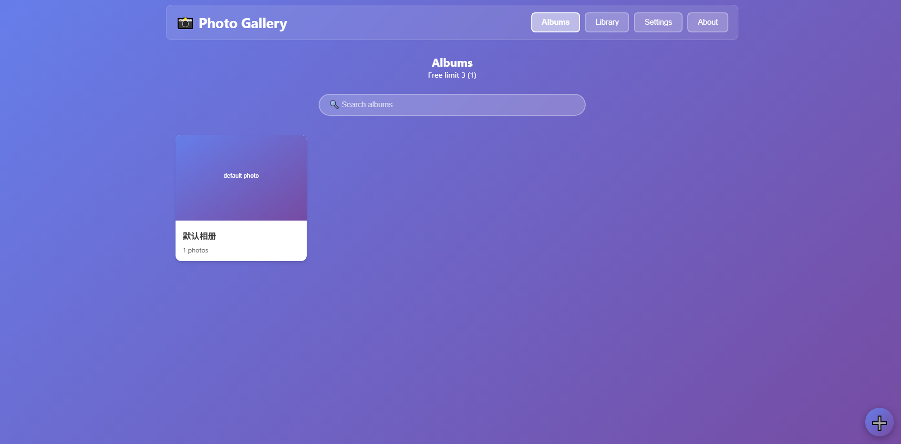
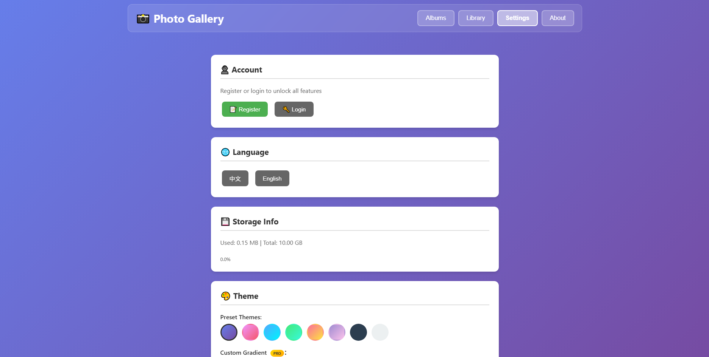

# 📸 照片集 (Local Photo Manager)

纯前端本地照片管理应用，数据存储在浏览器 IndexedDB，无需后端、无需联网。

A pure front-end local photo manager. Data lives in your browser's IndexedDB — no backend, no network.

> 版本 / Version: **beta 0.6.0** · 作者 / Author: Timespace233
> 仓库 / Repo: https://github.com/Timespace233/Local-Photo-Manager

---

## 📖 简介 / Introduction

**中文**

照片集是一个运行在浏览器里的轻量级照片管理工具。照片、相册、账户信息全部保存在本地 IndexedDB，不会上传到任何服务器。支持照片元数据编辑、多方式排序、多语言界面和主题切换。

使用原生 HTML / CSS / JavaScript 编写，**零第三方依赖，无构建步骤**。

<details>
<summary>English</summary>

A lightweight photo manager that runs entirely in your browser. Photos, albums, and account data are all stored locally in IndexedDB — nothing is uploaded to a server. Supports metadata editing, multiple sorting modes, multi-language UI, and theme switching.

Built with vanilla HTML / CSS / JavaScript. **Zero dependencies, no build step.**

</details>

---

## ✨ 功能 / Features

- 🗂️ **相册管理 / Albums**：创建、编辑、删除、设置封面；未注册最多 3 个 / Create, edit, delete, set cover; free users up to 3
- 🖼️ **照片管理 / Photos**：本地导入（按钮 / 拖拽）、元数据编辑、跨相册移动 / Import (button / drag), edit metadata, move between albums
- 🔍 **搜索与排序 / Search & Sort**：相册集 / 照片库 / 相册内搜索；按日期、标题、地点、随机、自定义拖拽 / Search everywhere; sort by date, title, location, random, custom drag
- 🎨 **主题 / Themes**：8 种预设渐变 + 自定义渐变（注册用户）/ 8 presets + custom gradient (registered)
- 🌐 **多语言 / i18n**：中文 / English 一键切换 / One-click switch
- 👤 **账户 / Account**：注册、登录、修改密码、注销；SHA-256 + 随机盐哈希 / Register, login, change password, delete; SHA-256 + salt
- 💾 **备份 / Backup**：导出 / 导入 JSON（注册用户）/ Export / import JSON (registered)
- ⚙️ **其他 / Misc**：存储空间可视化、显示设置、快捷键 / Storage usage, display settings, shortcuts

---

## 🚀 使用 / Usage

**方式一：直接打开 / Option 1: Open directly**

进入 `docs/` 目录，用浏览器打开 `index.html`。
Enter `docs/` and open `index.html` in your browser.

> ⚠️ `crypto.subtle` 在 `file://` 下部分浏览器受限，推荐方式二。
> `crypto.subtle` may be restricted under `file://` in some browsers. Option 2 recommended.

**方式二：本地服务器 / Option 2: Local server（推荐 / Recommended）**

```bash
cd docs
python -m http.server 8000
# 或 / or
npx serve
```

访问 / Visit: `http://localhost:8000`

**方式三：在线使用（GitHub Pages）/ Option 3: Online (GitHub Pages)**

无需下载，直接访问：

https://timespace233.github.io/Local-Photo-Manager/

> 注意：GitHub Pages 是 HTTPS 环境，`crypto.subtle` 可以正常使用，注册 / 登录功能不受限制。
>
> Note: GitHub Pages runs over HTTPS, so `crypto.subtle` works properly and register/login are fully functional.

**方式四：部署到其他静态托管 / Option 4: Deploy to Other Static Hosting**

本项目是纯静态文件，也可以部署到 Vercel、Netlify、Cloudflare Pages 等平台，发布目录选 `docs/`。

This project is purely static and can also be deployed to Vercel, Netlify, Cloudflare Pages, etc. Set the publish directory to `docs/`.

---

## 📁 项目结构 / Structure

```
Local-Photo-Manager/
├── docs/
│   ├── index.html      # 页面结构 / Page structure
│   ├── script.js       # 核心逻辑 / Core logic
│   └── style.css       # 样式 / Styles
├── assets/             # 截图、图标 / Screenshots, icons
├── README.md
├── LICENSE
└── .gitignore
```

---

## 🛠️ 技术栈 / Tech Stack

| 技术 / Tech | 用途 / Purpose |
|---|---|
| 原生 HTML5 / CSS3 / JS (ES6+) | 全部实现 / Full implementation |
| IndexedDB | 本地存储 / Local storage |
| Web Crypto API | SHA-256 密码哈希 / Password hashing |
| FileReader API | 读取本地图片 / Read local images |
| Storage API | 存储空间估算 / Storage estimation |
| SVG DataURL | 占位图生成 / Placeholder generation |

**零依赖，无构建。/ Zero dependencies, no build.**

---

## 🗄️ 数据存储 / Data Storage

数据库 `PhotoGalleryDB`，5 个对象仓库 / Database `PhotoGalleryDB`, 5 object stores:

| 仓库 / Store | 用途 / Purpose | 主键 / Key |
|---|---|---|
| `albums` | 相册 / Albums | `id` |
| `photos` | 照片（含 DataURL）/ Photos | `id` |
| `settings` | 设置 / Settings | `key` |
| `users` | 用户 / Users | `username` |
| `session` | 会话 / Session | `key` |

**数据不离开浏览器。** 清除浏览器数据或使用无痕模式会导致丢失，请用“导出备份”。
**Data never leaves your browser.** Clearing browser data or using incognito will lose it — use "Export Backup".

---

## 🔐 隐私与安全 / Privacy & Security

- 数据全部本地存储，不上传服务器 / All data stored locally, never uploaded
- 密码 SHA-256 + 随机盐哈希，不存明文 / Passwords hashed, no plaintext
- 纯前端应用，**无服务端验证**，账户系统仅用于本地多用户区分 / Pure front-end, **no server-side validation**; account system is only for local user separation
- 请勿用于存储敏感信息 / Do not use for sensitive information

---

## 🧭 快捷键 / Shortcuts

| 快捷键 / Key | 功能 / Function |
|---|---|
| `Ctrl + N` | 新建相册 / New album |
| `Ctrl + I` | 导入照片 / Import photos |
| `Esc` | 关闭弹窗 / Close modal |

---

## 📌 已知限制 / Known Limitations

- 照片以 Base64 DataURL 存于 IndexedDB，大量高清照片占空间较大 / Photos stored as Base64 DataURLs — many HD photos take significant space
- IndexedDB 配额因浏览器而异（几百 MB 到数 GB）/ Quota varies by browser (hundreds of MB to several GB)
- `file://` 下 `crypto.subtle` 可能不可用，建议用本地服务器 / `crypto.subtle` may be unavailable under `file://`
- 无服务端，账户系统非真正安全账户 / No backend; account system is not real security

---

## 📷 截图 / Screenshots




---

## 🤝 贡献 / Contributing

1. Fork 本仓库 / Fork this repo
2. 创建分支 / Create branch: `git checkout -b feature/your-feature`
3. 提交改动 / Commit: `git commit -m "Add some feature"`
4. 推送分支 / Push: `git push origin feature/your-feature`
5. 提交 PR / Open a Pull Request

---

## 📄 许可证 / License

[MIT License](LICENSE) · 自由使用、修改、分发 / Free to use, modify, distribute

---

## 👤 作者 / Author

**Timespace233**
GitHub: [@Timespace233](https://github.com/Timespace233) · 项目 / Project: [Local-Photo-Manager](https://github.com/Timespace233/Local-Photo-Manager)

---

## ⭐ 支持 / Support

如果这个项目对你有帮助，欢迎给个 Star ⭐
If this project helps you, please give it a Star ⭐